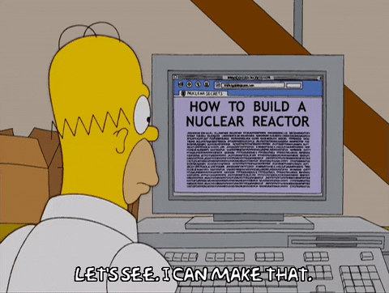

# Practical Reactor workshop (beta)

Welcome to practical Project Reactor and reactive programming workshop! 100+ unique exercise offers you production like experience or to improve existing Project Reactor skills by teaching best practices for building a reactive applications.

## Who is this workshop for?

Workshop is designed for relative beginners in Project Reactor, that already has some theory knowledge but lack hands-on experience.
If you are absolute beginner in Project Reactor, you might want to start with some theory what asynchronous, reactive programming is and how Project Reactor can help you with that.

If you are already familiar with Project Reactor or reactive programing, this workshop is for you.

### What do I need to start?
Knowing what Project Reactor is, what are Mono and Flux is enough to get you started!
Other than that you will need a nice IDE, like Intellij or Eclipse, time and Project Reactor reference guide!
No books and online courses needed, all chapters and exercises are linked to particular section in [reference guide](https://projectreactor.io/docs/core/release/reference/).

## How to start?

- Start by forking this repo
- Build this repo with simple `mvn clean install`.
- All the exercises are located in [exercises/src/test/java](exercises/src/test/java) package.
- All exercises are in the form of unit tests. If you run the test and test passes, that means you solved exercise successfully!
- All chapters are enumerated with number. Start with chapter 1.
- Every chapter contains read me documentation at the beginning of the file that describes what is the chapter and important links in reference guide that you should read before starting the chapter.
- Every exercise has written implementation requirements and `todo` markers that will point you where to start.

### Table of contents

* [Introduction](exercises/src/test/java/c1_Introduction.java)
* [Transforming sequence](exercises/src/test/java/c2_TransformingSequence.java)
* [Filtering sequence](exercises/src/test/java/c3_FilteringSequence.java)
* [Lifecycle hooks](exercises/src/test/java/c4_LifecycleHooks.java)
* [Creating sequence](exercises/src/test/java/c5_CreatingSequence.java)
* [Combining publishers](exercises/src/test/java/c6_CombiningPublishers.java)
* [Error handling](exercises/src/test/java/c7_ErrorHandling.java)
* [Sinks](exercises/src/test/java/c8_Sinks.java)
* [Execution control](exercises/src/test/java/c9_ExecutionControl.java)
* [Backpressure](exercises/src/test/java/c10_Backpressure.java)
* [Batching](exercises/src/test/java/c11_Batching.java)
* [Broadcasting](exercises/src/test/java/c12_Broadcasting.java)
* [Context](exercises/src/test/java/c13_Context.java)

## How to run?

- Navigate to chapter and exercise
- Implement the changes required in the exercise
- Run the test
- If test passes, you are done with the exercise!

### Are you stuck?
Sometimes it gets hard to find the right answer. Just a nudge might help.
While in `exercises` folder you can execute `mvn hint:{name_of_exercise}` and it will offer help how to solve exercise without giving out full solution.
Read exercise requirements carefully, often there is a hint in there too.

## Still stuck? (in progress)
Hints are just a nudge to steer you in the right direction.
If you are just stuck and can' solve the exercise, or you want to compare your solution with authors solution navigate to `solutions` branch.

Created with :heart: by [schananas](https://github.com/schananas)